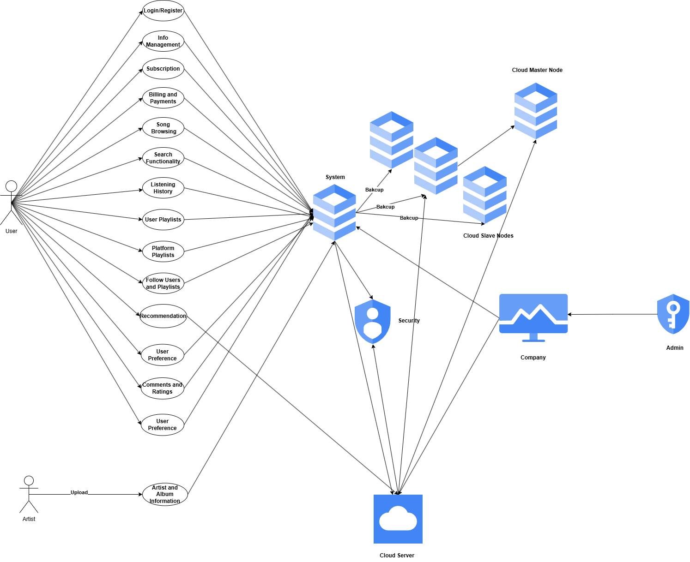

# Music Streaming Platform Project

## Project Overview
This repository contains a **full-stack music streaming platform** that integrates data from various sources, handles user authentication and playlist management, and provides machine learning-based music recommendations. The platform is composed of three main services:

1. **Backend Server (Flask + SQLite)** – Manages core application logic, database interactions, and REST API endpoints.  
2. **Frontend Application (React)** – Delivers a responsive user interface for playlist management, music playback, subscriptions, and comments.  
3. **Natural Language Query Interface (Gemini + BigQuery)** – Allows users to retrieve insights from the music database using natural language queries, powered by Google’s Gemini AI and BigQuery.



The architecture emphasizes scalability, real-time data updates, and seamless user experience. While the primary operational database uses SQLite for simplicity, integration with Google Cloud (BigQuery) supports analytics and advanced ML processing.

---

## Components

### 1. Backend Server
- **Technology**: Flask, Python 3, SQLite  
- **Responsibilities**:
  - User registration, login, and authentication  
  - Playlist creation, deletion, and song management  
  - Music search, playback endpoints  
  - Ratings and commenting system  
  - ORM-based data handling with SQLAlchemy  
- **Documentation**: [View Backend Documentation](backend_server/README.md)

### 2. Frontend Application
- **Technology**: React, Node.js  
- **Responsibilities**:
  - User-facing interface (homepage, search, playlists, subscriptions)  
  - Real-time data updates and interactive playback  
  - RESTful API calls to the Flask backend  
  - Rating and commenting UI  
- **Documentation**: [View Frontend Documentation](front_end_app/README.md)

### 3. Natural Language Query Interface
- **Technology**: Streamlit, Python, Google’s Gemini AI, BigQuery  
- **Responsibilities**:
  - Converts natural language questions into SQL queries for BigQuery  
  - Provides an intuitive, chat-based experience for administrators or curious users  
  - Displays query results in a user-friendly format  
- **Documentation**: [View NL Query Documentation](natural_language_query_chat_app/README.md)

---

## Quick Start

### Prerequisites
- **Python 3.9+**  
- **Node.js** (for the React frontend)  
- **SQLite** (for local development of the backend)  
- **Google Cloud account** (required for Gemini and BigQuery integration)

### Installation

1. **Clone the repository**:
   ```bash
   git clone [repository-url]
   cd MusicStreamingPlatform

	2.	Set up the Backend:

cd backend_server
pip install -r requirements.txt
python run.py

	•	This starts the Flask application on the default port (e.g., http://127.0.0.1:5000).

	3.	Set up the Frontend:

cd ../front_end_app
npm install
npm start

	•	Access the React application at http://localhost:3000.

	4.	Set up the NL Query Interface:

cd ../natural_language_query_chat_app
pip install -r requirements.txt
streamlit run app.py

	•	Launches the Streamlit interface for natural language queries, accessible at the URL Streamlit provides.

Architecture

This project follows a microservices-inspired architecture:
	•	Backend API Service: Handles OLTP (Online Transaction Processing), including user authentication, playlist management, and content retrieval.
	•	Frontend Client Application: Provides the web-based user experience with React and communicates with the backend via REST APIs.
	•	Natural Language Query Service: Operates independently of the main backend, converting user questions into SQL queries against BigQuery via Google’s Gemini AI.

Although SQLite is used for local data storage, the system can be adapted to use other relational databases (e.g., PostgreSQL, MySQL). For advanced analytics and machine learning, Google Cloud services (BigQuery, Vertex AI) are utilized.

Contributing

We welcome contributions of any kind—whether it’s reporting bugs, suggesting new features, or submitting pull requests. Please see our Contributing Guidelines for more details.

License

This project is licensed under the MIT License. You are free to use, modify, and distribute this software as specified by the license terms.

Team
	•	Alvin Li  
	•	Jiahe Tian  
	•	Yi Wang  

Acknowledgments
	•	Course: CSCI-GA 2433 Database Systems  
	•	Instructed by Prof. Jean-Claude Franchitti at New York University    
	•	Additional thanks to the open-source libraries and community resources that made this project possible.  
