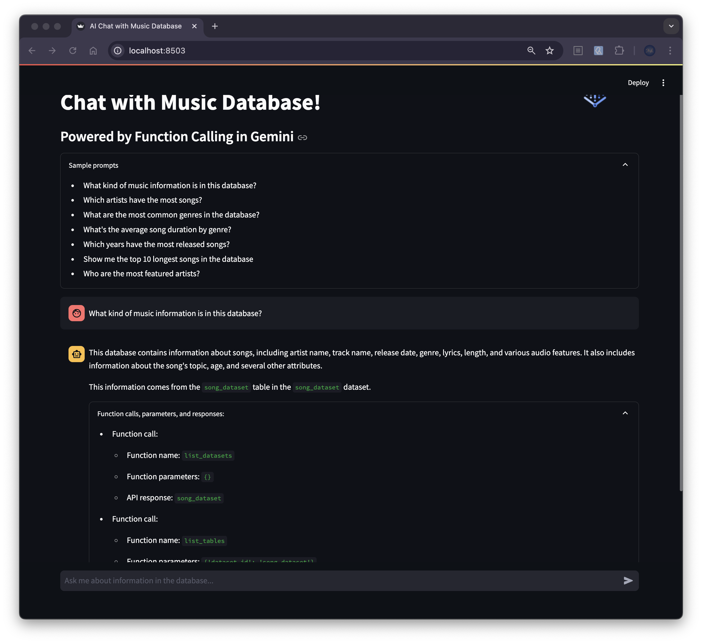

# Natural Language to BigQuery with Music Database

## Overview

This app demonstrates how to use natural language to query a music database using Gemini's Function Calling capabilities. Ask questions about songs, artists, and genres in plain English, and get SQL-powered responses from BigQuery.



## Prerequisites

- A Google Cloud project with billing enabled
- Python 3.9 or higher
- The following APIs enabled:
  - Vertex AI
  - BigQuery
  - BigQuery Data Transfer

## Quick Start

1. Clone this repository
2. Set up your Google Cloud credentials:
```bash
gcloud auth application-default login
```

3. Install dependencies:
```bash
pip install -r requirements.txt
```

4. Run the app:
```bash
streamlit run app.py
```

## Sample Questions

You can ask questions like:
- What kind of music information is in this database?
- Which artists have the most songs?
- What are the most common genres in the database?
- What's the average song duration by genre?
- Which years have the most released songs?
- Show me the top 10 longest songs
- Who are the most featured artists?

## Project Structure

- `app.py` - Main application code
- `setup.sh` - Setup script for dependencies and services
- `requirements.txt` - Python package dependencies

## Running from Different Directory

If you want to run the app from a different directory, use the full path:
```bash
streamlit run /path/to/your/app.py
```

## Troubleshooting

If you encounter authentication issues:
1. Verify your Google Cloud project ID
2. Ensure you're logged in with the correct account
3. Check that all required APIs are enabled
4. Verify your credentials are properly set up
